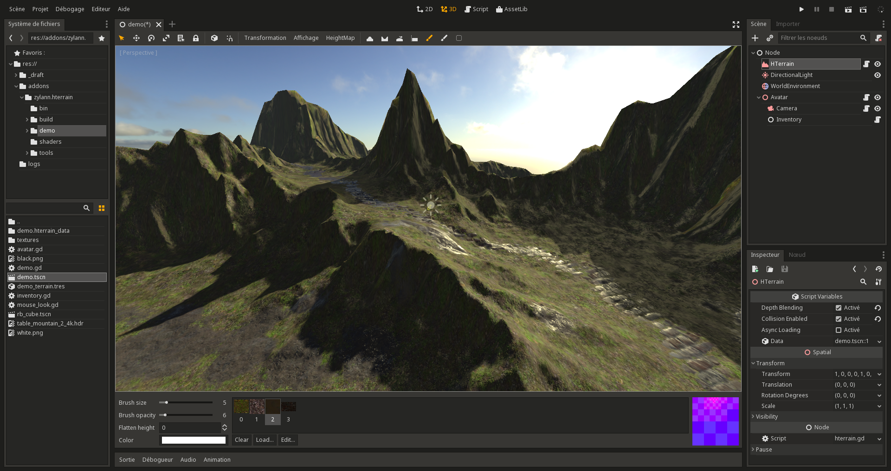

HeightMap terrain plugin for Godot Engine 3.x
================================================

Heightmap-based terrain for Godot 3.x, using GDScript, C++ and GDNative (engine recompilation is not needed).
It was forked from its former module implementation: https://github.com/Zylann/godot_heightmap_module

WARNING: under development, still very rough and may be buggy.

Installation
--------------

This is a regular editor plugin.
Copy the contents of `addons/zylann.hterrain` into the same folder in your project, and activate it in your project settings.

Language notes
----------------------

The editor part of this plugin is implemented using GDScript and regular scenes, for practical reasons.

The core part is implemented both in C++ and GDScript. They have both the same features and APIs, but for now only the GDScript implementation is working on theoretically all platforms.
The C++ implementation is a lot faster, but is tricky and unstable to use for now. It will get updated over time as GDNative C++ bindings are improved.

By default, the GDScript implementation is used by default. Switching to C++ requires to compile the GDNative library and reference `.gdns` files instead of `.gd` in the plugin's source code.
