HTerrain plugin documentation
===============================

Overview
----------

This plugin allows to create heightmap-based terrains in Godot Engine. This kind of terrain uses 2D images, such as for heights or texturing information, which makes it cheap to implement while covering most use cases.

It is entirely built on top of the `VisualServer` scripting API, which means it should be expected to work on all platforms supported by Godot's `GLES3` renderer.

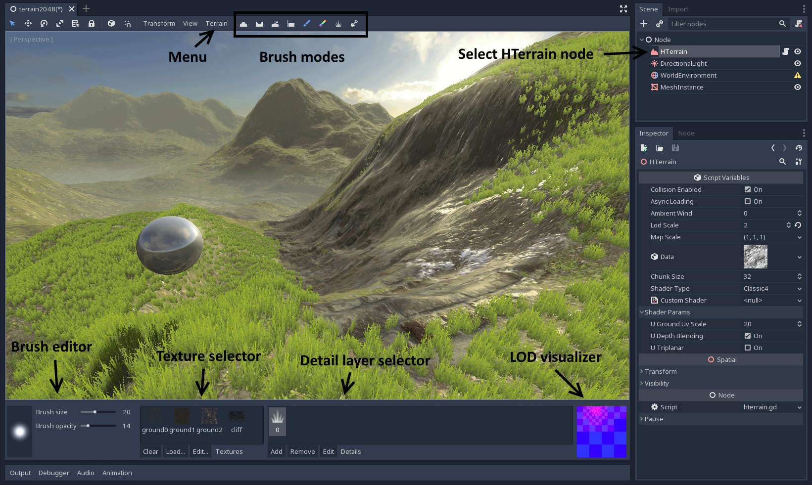


### Video tutorials

This written doc should be the most up to date and precise information, but video tutorials exist for a quick start.

- [Kasper's tutorial](https://www.youtube.com/watch?v=Af1f2JPvSIs) about version 1.5.2 (16 Jan 2021)
- [GamesFromScratch presentation](https://www.youtube.com/watch?v=jYVO0-_sXZs), also featuring the [WaterWays](https://github.com/Arnklit/WaterGenGodot) plugin (23 dec 2020)
- [qubodupDev's Tutorial](https://www.youtube.com/watch?v=k_ISq6JyVSs) about version 1.3.3 (27 aug 2020)
- [Old tutorial](https://www.youtube.com/watch?v=eZuvfIHDeT4&) about version 0.8 (10 aug 2018! A lot is outdated in it but let's keep it here for the record)

### How to install

You will need to use Godot 3.1 or later. It is best to use latest stable 3.x version (Godot 4 is not supported yet).

#### Automatically

In Godot, go to the Asset Library tab, search for the terrain plugin, download it and then install it. 
Then you need to activate the plugin in your `ProjectSettings`.

#### Manually

The plugin can be found on the [Asset Library website](https://godotengine.org/asset-library/asset/231). The download will give you a `.zip` file. Decompress it at the root of your project. This should make it so the following hierarchy is respected:

```
addons/
    zylann.hterrain/
        <plugin files>
```

Then you need to activate the plugin in your `ProjectSettings`.


### How to update

When a new version of the plugin comes up, you may want to update. If you re-run the same installation steps, it should work most of the time. However this is not a clean way to update, because files might have been renamed, moved or deleted, and they won't be cleaned up. This is an issue with Godot's plugin management in general (TODO: [make a proposal](https://github.com/godotengine/godot-proposals/issues)).

So a cleaner way would be:

- Turn off the plugin
- Close all your scenes (or close Godot entirely)
- Delete the `addons/zylann.hterrain` folder
- Then install the new version and enable it


### Development versions

The latest development version of the plugin can be found on [Github](https://github.com/Zylann/godot_heightmap_plugin).
It is the most recently developped version, but might also have some bugs.


Creating a terrain
--------------------

### Creating a HTerrain node

Features of this plugin are mainly available from the `HTerrain` node. To create one, click the `+` icon at the top of the scene tree dock, and navigate to this node type to select it.

There is one last step until you can work on the terrain: you need to specify a folder in which all the data will be stored. The reason is that terrain data is very heavy, and it's a better idea to store it separately from the scene.
Select the `HTerrain` node, and click on the folder icon to choose that folder.

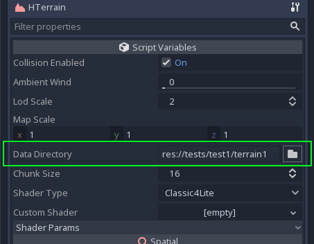

Once the folder is set, a default terrain should show up, ready to be edited.

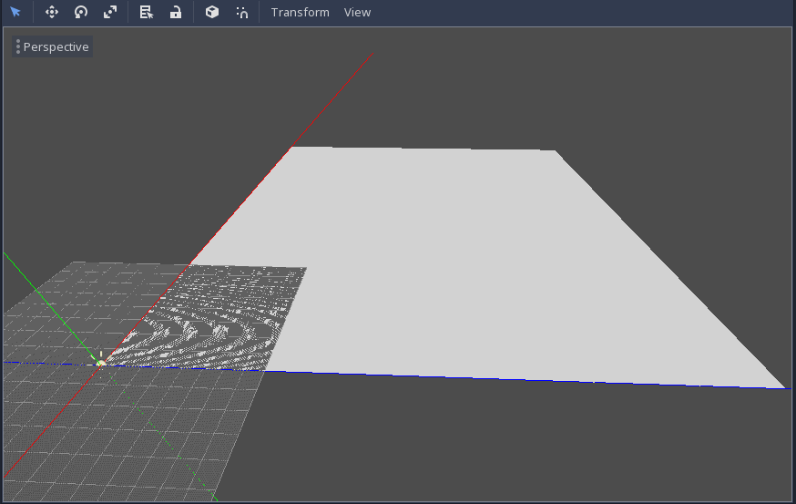

!!! note
    If you don't have a default environment, it's possible that you won't see anything, so make sure you either have one, or add a light to the scene to see it. Also, because terrains are pretty large (513 units by default), it is handy to change the view distance of the editor camera so that you can see further: go to `View`, `Options`, and then increase `far distance`.

### Terrain dimensions

By default, the terrain is a bit small, so if you want to make it bigger, there are two ways:

- Modify `map_scale`, which will scale the ground without modifying the scale of all child nodes while using the same memory. As the scale cannot be equal or less than `0`, the limit of `0.01` (1 cm per cell) was set as an arbitrary safety guard. This value is still high enough to not run into precision floating-point problems.
- Use the `resize` tool in the `Terrain` menu, which will increase the resolution instead and take more memory.


If you use the `resize` tool, you can also choose to either stretch the existing terrain, or crop it by selecting an anchor point. Currently, this operation is permanent and cannot be undone, so if you want to go back, you should make a backup.

!!! note
    The resolution of the terrain is limited to powers of two + 1, mainly because of the way LOD was implemented. The reason why there is an extra 1 is down to the fact that to make 1 quad, you need 2x2 vertices. If you need LOD, you must have an even number of quads that you can divide by 2, and so on. However there is a possibility to tweak that in the future because this might not play well with the way older graphics cards store textures.


Sculpting
-----------

### Brush types

The default terrain is flat, but you may want to create hills and mountains. Because it uses a heightmap, editing this terrain is equivalent to editing an image. Because of this, the main tool is a brush with a configurable size and shape. You can see which area will be affected inside a 3D red circle appearing under your mouse, and you can choose how strong painting is by changing the `Brush opacity` slider.

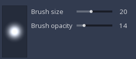

To modify the heightmap, you can use the following brush modes, available at the top of the viewport:

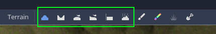

- **Raise**: raises the height of the terrain to produce hills
- **Lower**: digs down to create crevices
- **Smooth**: smoothes heights locally
- **Level**: averages the heights within the radius of the brush until ground eventually becomes flat
- **Flatten**: directly sets the height to a given value, which can be useful as an eraser or to make plateaux. It is also possible to pick a height from the viewport using the picking button.
- **Erode**: smoothes the landscape by simulating erosion. When used on noisy terrain, it often produces characteristic shapes found in nature.

!!! note
    Heightmaps work best for hills and large mountains. Making sharp cliffs or walls are not recommended because it stretches geometry too much, and might cause issues with collisions. To make cliffs it's a better idea to place actual meshes on top.

### Normals

As you sculpt, the plugin automatically recomputes normals of the terrain, and saves it in a texture. This way, it can be used directly in ground shaders, grass shaders and previews at a smaller cost. Also, it allows to keep the same amount of details in the distance independently from geometry, which allows for levels of detail to work without affecting perceived quality too much.


### Collisions

You can enable or disable collisions by checking the `Collisions enabled` property in the inspector.

Heightmap-based terrains usually implement collisions directly using the heightmap, which saves a lot of computations compared to a classic mesh collider.
This plugin depends on the **Bullet Physics** integration in Godot, which does have a height-field collider. **Godot Physics** does not support it until version 3.4, so if you use an older version, you may want to make sure Bullet is enabled in your project settings:

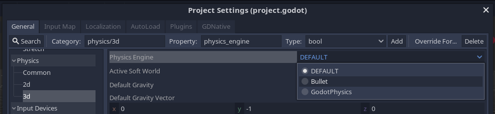

Some editor tools rely on colliders to work, such as snapping to ground or plugins like Scatter or other prop placement utilities. To make sure the collider is up to date, you can force it to update after sculpting with the `Terrain -> Update Editor Collider` menu:


#### Known issues

- **Updating the collider**: In theory, Bullet allows us to specify a direct reference to the image data. This would allow the collider to automatically update for free. However, we still had to duplicate the heightmap for safety, to avoid potential crashes if it gets mis-used. Even if we didn't copy it, the link could be broken anytime because of internal Copy-on-Write behavior in Godot. This is why the collider update is manual, because copying the heightmap results in an expensive operation. It can't be threaded as well because in Godot physics engines are not thread-safe yet. It might be improved in the future, hopefully.

- **Misaligned collider in editor**: At time of writing, the Bullet integration has an issue about colliders in the editor if the terrain is translated, which does not happen in game: [Godot issue #37337](https://github.com/godotengine/godot/issues/37337)


### Holes

It is possible to cut holes in the terrain by using the `Holes` brush. Use it with `draw holes` checked to cut them, and uncheck it to erase them. This can be useful if you want to embed a cave mesh or a well on the ground. You can still use the brush because holes are also a texture covering the whole terrain, and the ground shader will basically discard pixels that are over an area where pixels have a value of zero.

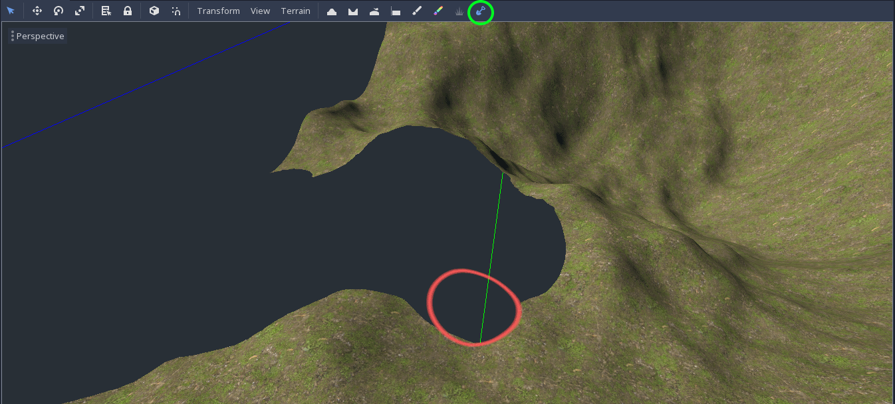

At the moment, this brush uses the alpha channel of the color map to store where the holes are.

!!! note
    This brush only produces holes visually. In order to have holes in the collider too, you have to do some tricks with collision layers because the collision shape this plugin uses (Bullet heightfield) cannot have holes. It might be added in the future, because it can be done by editing the C++ code and drop collision triangles in the main heightmap collision routine.

    See [issue 125](https://github.com/Zylann/godot_heightmap_plugin/issues/125)


### Level of detail

This terrain supports level of details on the geometry using a quad tree. It is divided in chunks of 32x32 (or 16x16 depending on your settings), which can be scaled by a power of two depending on the distance from the camera. If a group of 4 chunks are far enough, they will join into a single one. If a chunk is close enough, it will split in 4 smaller ones. Having chunks also improves culling because if you had a single big mesh for the whole terrain, that would be a lot of vertices for the GPU to go through.
Care is also taken to make sure transitions between LODs are seamless, so if you toggle wireframe rendering in the editor you can see variants of the same meshes being used depending on which LOD their neighbors are using.

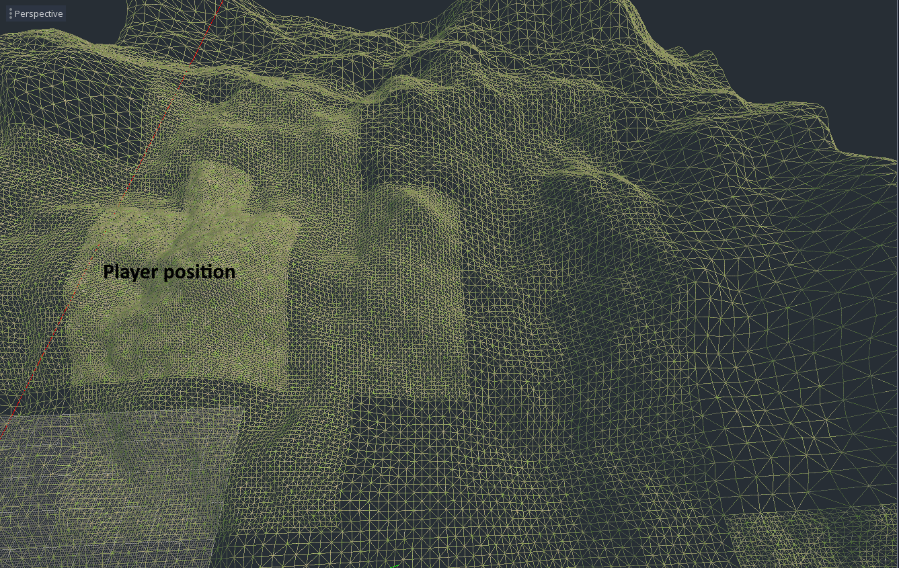

LOD can be mainly tweaked in two ways:

- `lod scale`: this is a factor determining at which distance chunks will split or join. The higher it is, the more details there will be, but the slower the game will be. The lower it is, the faster quality will decrease over distance, but will increase speed.
- `chunk size`: this is the base size of a chunk. There aren't many values that it can be, and it has a similar relation as `lod scale`. The difference is, it affects how many geometry instances will need to be culled and drawn, so higher values will actually reduce the number of draw calls. But if it's too big, it will take more memory due to all chunk variants that are precalculated.

In the future, this technique could be improved by using GPU tessellation, once the Godot rendering engine supports it. GPU clipmaps are also a possibility, because at the moment the quad tree is updated on the CPU.

!!! note
    Due to limitations of the Godot renderer's scripting API, LOD only works around one main camera, so it's not possible to have two cameras with split-screen for example. Also, in the editor, LOD only works while the `HTerrain` node is selected, because it's the only time the EditorPlugin is able to obtain camera information (but it should work regardless when you launch the game).


Texturing
-----------

### Overview

Applying textures to terrains is a bit different than single models, because they are very large and a more optimal approach needs to be taken to keep memory and performance to an acceptable level. One very common way of doing it is by using a splatmap. A splatmap is another texture covering the whole terrain, whose role is to store which detail textures should be blended, and these textures may repeat seamlessly.


This magic is done with a single shader, i.e a single `ShaderMaterial` in Godot's terminology. This material is handled internally by the plugin, but you can customize it in several ways.

There are mainly 3 families of shaders this plugin supports:

- `CLASSIC4`: simple shaders where each texture may be a separate resource. They are limited to 4 textures.
- `MULTISPLAT16`: more advanced shader using more splatmaps and texture arrays. It's expensive but supports up to 16 textures.
- `ARRAY`: experimental shader also using texture arrays, which comes with constraints, but allows to paint a lot more different textures.
- Other shaders don't need textures, like `LOW_POLY`, which only uses colors.

On the `HTerrain` node, there is a property called `shader_type`, which lets you choose among built-in shaders. The one you choose will define which workflow to follow: textures, or texture arrays.

At time of writing, `CLASSIC4` shaders are better supported, and are the default choice.
Texture array shaders may be used more in the future.


### Getting PBR textures

*If you only plan to use simple color textures, you can skip to [Texture Sets](#texture-sets).*

Before you can paint textures, you have to set them up. It is recommended to pick textures which can tile infinitely, and preferably use "organic" ones, because terrains are best-suited for exterior natural environments.
For each texture, you may find the following types of images, common in PBR shading:

- Albedo, color, or diffuse (required)
- Bump, height, or displacement (optional)
- Normal, or normalmap (optional)
- Roughness (optional)


You can find some of these textures for free at [cc0textures.com](http://cc0textures.com).

!!! note: Some shaders have a `Lite` and non-lite versions. One main difference between them is that `Lite` versions don't require normal maps, but the others require them. If you use a non-lite shader and forget to assign normal maps, shading will look wrong.

It is preferable to place those source images under a specific directory. Also, since the images will only serve as an input to generate the actual game resources, it is better to place a `.gdignore` file inside that directory. This way, Godot will not include those source files in the exported game:

```
terrain_test/
    terrain_data/
        height.res
        data.hterrain
        ...
    textures_src/
        .gdignore
        grass_albedo.png
        grass_bump.png
        grass_normal.png
        grass_roughness.png
        rocks_albedo.png
        rocks_bump.png
        rocks_normal.png
        rocks_roughness.png
        ...
    terrain_scene.tscn
    ...
```

!!! note
    While bump might not be used often, this plugin actually uses it to achieve [better blending effects](#depth-blending).


### Using the import tool

Ground textures are stored in a `HTerrainTextureSet` resource. All terrains come with a default one. However, it can be tedious to setup every texture and pack them, especially if you need PBR.

This plugin comes with an optional import tool. Select your `HTerrain` node, and in the bottom panel, click the `Import...` button:


This brings up the import tool dialog:

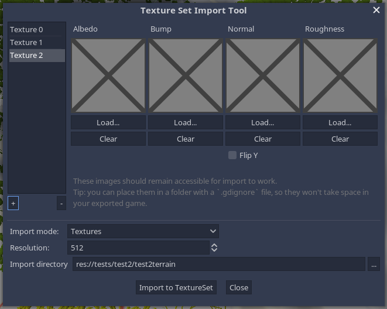

#### Import mode

One of the first important things is to decide which import mode you want to use:

- `Textures`: For simple terrains with up to 4 textures (in use with `CLASSIC4` shaders)
- `TextureArrays`: For more complex terrains with up to 16 textures (in use with `MULTISPLAT16` and `ARRAY` shaders)

This choice depends on the shader you will use for the terrain. Some shaders expect individual textures and others expect texture arrays.

#### Smart file pick

If you use PBR textures, there might be a lot of files to assign. If you use a naming convention, you can start loading an albedo texture, and the tool will attempt to find all the other maps automatically by recognizing other image file names. For example, using this convention may allow this shortcut to work:

- `grass_albedo.png`
- `grass_bump.png`
- `grass_normal.png`
- `grass_roughness.png`


#### Normal maps

As indicated in the [Godot documentation](https://docs.godotengine.org/en/stable/tutorials/3d/spatial_material.html#normal-map), normal maps are expected to use OpenGL convention (X+, Y+, Z+). So it is possible that normalmaps you find online use a different convention.

To help with this, the import tool allows you to flip Y, in case the normalmap uses DirectX convention.

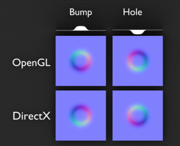


#### Importing

When importing, this tool will need to generate a few files representing intermediate Godot resources. You may have to choose the directory where those resources will be created, otherwise they will be placed at the root of your project.

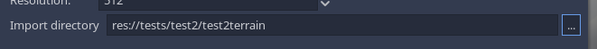

Once everything is ready, you can click `Import`. This can take a little while.
If all goes well, a popup will tell you when it's done, and your terrain's texture set will be filled up with the imported textures.

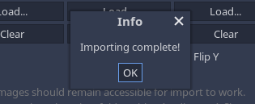

If importing goes wrong, most of the time an error will show up and the `HTerrainTextureSet` will not be modified.
If it succeeded but you are unhappy with the result, it is possible to undo the changes done to the terrain using `Ctrl+Z`.

!!! note
    - If you need to change something after the first import, you can go back to the importing tool and change settings, then click `Import` again.
    - Importing with this tool will overwrite the whole set each time.
    - The tool does not store the settings anywhere, but it should fill them up as much as it can from existing sets so you shouldn't need to fill everything up again.
    - Custom importers are used as backend in order to support these features automatically, instead of default Godot importers. If you need more tinkering, you can take a look at [packed texture importers](#packed-texture-importers).


### Texture Sets

#### Description

`HTerrainTextureSet` is a custom resource which contains all textures a terrain can blend on the ground (grass, dirt, rocks, leaves, snow, sand...). All terrains come with an empty one assigned by default.

The import tool seen earlier is the quickest way to fill one up from base textures, but it is not mandatory if you prefer to do things manually.

You can inspect and edit the current set by selecting your `HTerrain` node, and in the bottom panel "Textures" section, click `Edit...`:


This opens the following dialog:

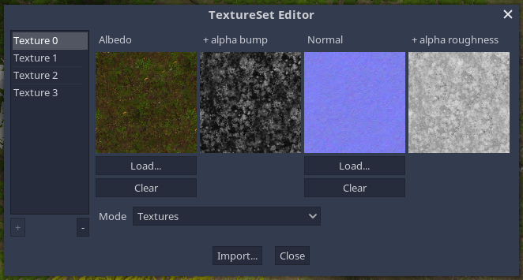

Unlike the import tool, this dialog shows you the actual resources used by the terrain. They may be either pairs of two packed textures for each slot, or two `TextureArray` resources.

If you are using a `CLASSIC4` shader, you should be able to add and remove slots using the `+` and `-` buttons, and directly load color textures in the `Albedo` channel.
For using texture arrays or PBR textures, it might be better to use the [import tool](#getting-pbr-textures).

Actions done in this dialog behave like an extension of the inspector, and can be undone with `Ctrl+Z`.


#### Re-using a texture set

Texture sets are embedded in terrains by default, but it is possible to use the same set on another terrain. To do this, the `HTerrainTextureSet` must be saved as a `.tres` file.


- Select your `HTerrain` node
- In the inspector, right-click on the value of the `texture_set` property
- A HUGE menu will open (this is a Godot issue). Scroll all the way down with mouse wheel.
- Click the `Edit...` menu item to edit the resource
- On top of the inspector, a floppy disk icon should appear. You can click on it and choose `Save As...`


- A file dialog will prompt you for the location you want to put the resource file. Once you're done, click `Save`.

Once you have a `.tres` file, you will be able to pick it up in your other terrain, by clicking on the `texture_set` property, but choosing `Load` this time.
You can also navigate to the `.tres` file in the `FileSystem` dock, then drag and drop to the property.


### Shader types

#### Classic4

The `CLASSIC4` shader is a simple splatmap technique, where R, G, B, A match the weight of 4 respective textures. Then are all blended together in every pixel of the ground. Here is how it looks when applied:


It comes in two variants:

- `CLASSIC4`: full-featured shader, however it requires your textures to have normal maps. If you don't assign them, shading will look wrong.
- `CLASSIC4_LITE`: simpler shader with less features. It only requires albedo textures.


#### MultiSplat16

the `MULTISPLAT16` shader is an extension of the splatmap technique, but uses 4 splatmaps instead of 1. It also uses `TextureArrays` instead of individual textures. It allows to support up to 16 textures at once, and can blend up to 4 in the same pixel. It dynamically chooses the 4 most-representative textures to blend them.

It also comes in two variants:

- `MULTISPLAT16`: full-featured shader, however it requires your texture arrays to have normal maps.
- `MULTISPLAT16_LITE`: simpler shader with less features. It only requires albedo texture arrays.

It is the recommended choice if you need more than 4 textures, because it is much easier to use than the `ARRAY` shader and produces less artifacts.

One downside is performance: it is about twice slower than `CLASSIC4` (on an nVidia 1060, a fullscreen `CLASSIC4` is 0.8 ms, while `MULTISPLAT16` is 1.8 ms).
Although, considering objects placed on the terrain should usually occlude ground pixels, the cost might be lower in a real game scenario.


#### LowPoly

The `LOWPOLY` shader is the simplest shader. It produces a faceted look with only simple colors, and no textures. You will need to use the color brush to paint it.

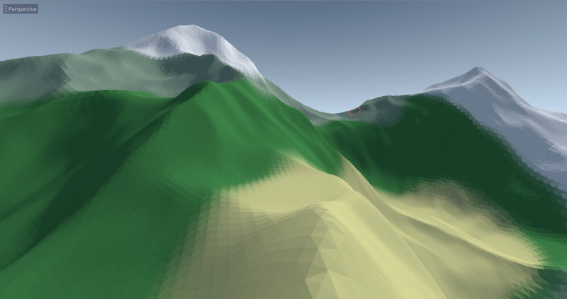

!!! note
    If you need faceted visuals with other shaders using textures, you can obtain the same result by [customizing the shader](#custom-shaders), and adding this line at the end of `fragment()`:
    `NORMAL = normalize(cross(dFdx(VERTEX), dFdy(VERTEX)));`


#### Array

**WARNING: this shader is still experimental. It's not ideal and has known flaws, so it may change in the future.**

The `ARRAY` shader uses a more advanced technique to render ground textures. Instead of one splatmap and many individual textures, it uses a weightmap, an index map, and a `TextureArray`.

The two maps are different from the classic one:

- `SPLAT_INDEX`: this one stores the indexes of the textures to blend in every pixel of the ground. Indexes are stored respectively in R, G and B, and correspond to layers of the `TextureArray`.
- `SPLAT_WEIGHT`: this one stores the weight of the 3 textures to blend on each pixel. It only has R and G channels, because the third one can be inferred (their sum must be 1).

This allows to paint up to 256 different textures, however it introduces an important constraint: you cannot blend more than 3 textures at a given pixel.

Painting the proper indexes and weights can be a challenge, so for now, the plugin comes with a compromise. Each texture is assigned a fixed color component, R, G or B. So for a given texture, all textures that have an index separated by a multiple of 3 from this texture will not always be able to blend with it. For example, texture `2` might not blend with texture `5`, `8`, `11`, `14` etc. So choosing where you place textures in the `TextureArray` can be important.

Here is a close-up on an area where some textures are not totally blending, because they use the same color component:


In this situation, another workaround is to use a transition texture: if A and B cannot blend, use texture C which can blend with A and B:

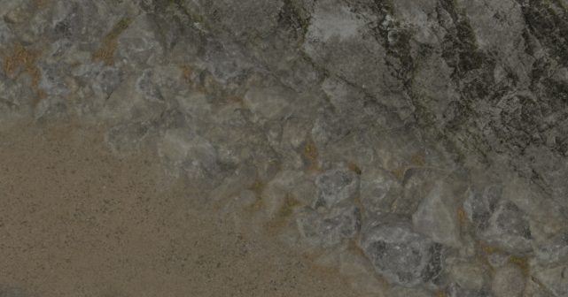

You may see this pop up quite often when using this shader, but it can often be worked around.
The brush for this isn't perfect. This limitation can be smoothed out in the future, if a better algorithm is found which can work in real-time.


### Creating a `TextureArray` manually

!!! note
    It is now possible to use the [import tool](#using-the-import-tool) to set this up automatically. The following description explains how to do it manually.

Contrary to `CLASSIC4` shaders, you cannot directly assign individual textures with a shader that requires `TextureArray`. Instead, you'll have to import one.

1) With an image editor, create an image, which you subdivide in square tiles, like an atlas. I each of them, place one ground texture, like so:

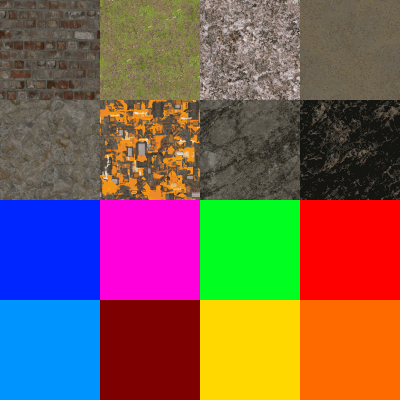

2) Place that atlas in your Godot project. The editor will attempt to import it a first time, it can take a while if it's big.

3) Select the atlas, and go to the `Import` dock. Change the import type to `TextureArray`.


4) Make sure the `Repeat` mode is enabled. Then, change the tile counts below to match your grid. Once you're done, click `Re-import`. Godot will ask you to restart the editor, do that (I have no idea why).

5) Once the editor has restarted, select your terrain node, and make sure it uses the `ARRAY` shader type (or a similar custom shader). In the bottom panel, click on the `Edit...` button to edit the `HTerrainTextureSet` used by the terrain.

6) In the dialog, click on the `Load Array...` button under `Albedo` to load your texture array. You can do the same process with normal maps if needed.

7) The bottom panel should now update to show much more texture slots. They will appear in the same order they are in the atlas, from left-to-right. If the panel doesn't update, select another node and click the terrain again. You should now be able to paint.


### Packing textures manually

!!! note
    It is now possible to use the [import tool](#using-the-import-tool) to set this up automatically. The following description explains how to do it manually.

The main ground shaders provided by the plugin should work fine with only regular albedo, but it supports a few features to make the ground look more realistic, such as normal maps, bump and roughness. To achieve this, shaders expects packed textures. The main reason is that more than one texture has to be sampled at a time, to allow them to blend. With a classic splatmap, it's 4 at once. If we want normalmaps, it becomes 8, and if we want roughness it becomes 12 etc, which is already a lot, in addition to internal textures Godot uses in the background. Not all GPUs allow that many textures in the shader, so a better approach is to combine them as much as possible into single images. This reduces the number of texture units, and reduces the number of fetches to do in the pixel shader.

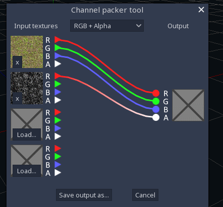

For this reason, the plugin uses the following convention in ground textures:

- `Albedo` in RGB, `Bump` in A
- `Normal` in RGB, `Roughness` in A

This operation can be done in an image editing program such as Gimp, or with a Godot plugin such as [Channel Packer](https://godotengine.org/asset-library/asset/230).
It can also be done using [packed texture importers](packed-texture-importers), which are now included in the plugin.

!!! note
	Normal maps must follow the OpenGL convention, where Y goes up. They are recognizable by being "brighter" on the top of bumpy features (because Y is green, which is the most energetic color to the human eye):

	

	See also [Godot's documentation notes about normal maps](https://docs.godotengine.org/en/latest/getting_started/workflow/assets/importing_images.html#normal-map)

!!! note
	Because Godot would strip out the alpha channel if a packed texture was imported as a normal map, you should not make your texture import as "Normal Map" in the importer dock.


### Packed texture importers

In order to support the [import tool](#using-the-import-tool), this plugin defines two special texture importers, which allow to pack multiple input textures into one. They otherwise behave the same as Godot's default importers.

The type of file they import are JSON files, which refer to the source image files you wish to pack together, along with a few other options.

#### Packed textures

File extension: `.packed_tex`

Example for an albedo+bump texture:
```json
{
    "contains_albedo": true,
    "src": {
        "rgb": "res://textures/src/grass_albedo.png",
        "a": "res://textures/src/grass_bump.png",
    }
}
```

Example for a normal+roughness texture, with conversion from DirectX to OpenGL (optional):
```json
{
    "src": {
        "rgb": "res://textures/src/rocks_normal.png",
        "a": "res://textures/src/rocks_roughness.png",
        "normalmap_flip_y": true
    }
}
```

You can also specify a plain color instead of a path, if you don't need a texture. It will act as if the source texture was filled with this color. The expected format is ARGB.

```
    "rgb": "#ff888800"
```

#### Packed texture arrays

File extension: `.packed_texarr`

This one requires you to specify a `resolution`, because each layer of the texture array must have the same size and be square. The resolution is a single integer number.
What you can put in each layer is the same as for [packed textures](#packed-textures).

```json
{
    "contains_albedo": true,
    "resolution": 1024,
    "layers": [
        {
            "rgb": "res://textures/src/grass_albedo.png",
            "a": "res://textures/src/grass_bump.png"
        },
        {
            "rgb": "res://textures/src/rocks_albedo.png",
            "a": "res://textures/src/rocks_bump.png"
        },
        {
            "rgb": "res://textures/src/sand_albedo.png",
            "a": "res://textures/src/sand_bump.png"
        }
    ]
}
```

#### Limitations

Such importers support most of the features needed for terrain textures, however some features found in Godot's importers are not implemented. This is because Godot does not have any API to extend the existing importers, so they had to be re-implemented from scratch in GDScript. For example, lossy compression to save disk space is not supported, because it requires access to WebP compression API which is not exposed.

See [Godot proposal](https://github.com/godotengine/godot-proposals/issues/1943)


### Depth blending

`Bump` textures holds a particular usage in this plugin:
You may have noticed that when you paint multiple textures, the terrain blends them together to produce smooth transitions. Usually, a classic way is to do a "transparency" transition using the splatmap. However, this rarely gives realistic visuals, so an option is to enable `depth blending` under `Shader Params`.

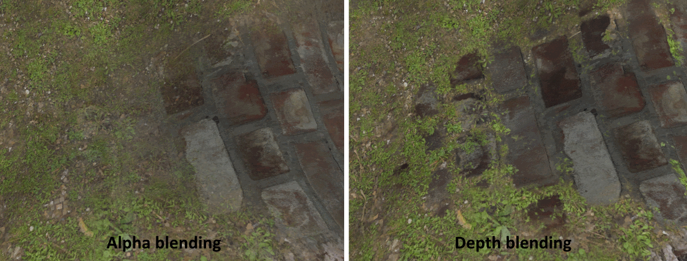

This feature changes the way blending operates by taking the bump of the ground textures into account. For example, if you have sand blending with pebbles, at the transition you will see sand infiltrate between the pebbles because the pixels between pebbles have lower bump than the pebbles. You can see this technique illustrated in a [Gamasutra article](https://www.gamasutra.com/blogs/AndreyMishkinis/20130716/196339/Advanced_Terrain_Texture_Splatting.php).
It was tweaked a bit to work with 3 or 4 textures, and works best with fairly low brush opacity, around 10%.


### Triplanar mapping

Making cliffs with a heightmap terrain is not recommended, because it stretches the geometry too much and makes textures look bad. Nevertheless, you can enable triplanar mapping on such texture in order for it to not look stretched. This option is in the shader section in the inspector.

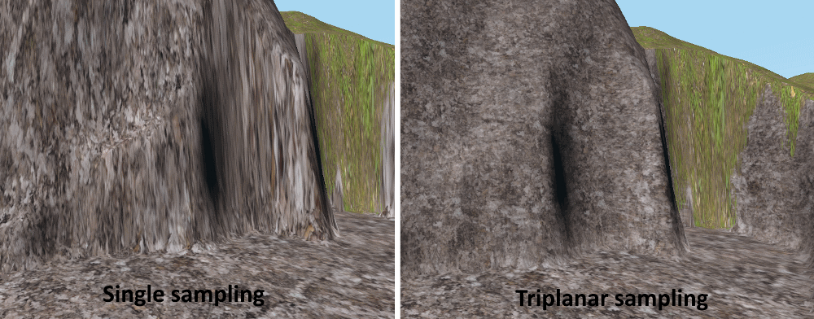

In the case of the `CLASSIC4` shader, cliffs usually are made of the same ground texture, so it is only available for textures setup in the 4th slot, called `cliff`. It could be made to work on all slots, however it involves modifying the shader to add more options, which you may see in a later article.

The `ARRAY` shader does not have triplanar mapping yet, but it may be added in the future.


### Tiling reduction

The fact repeating textures are used for the ground also means they will not look as good at medium to far distance, due to the pattern it produces:

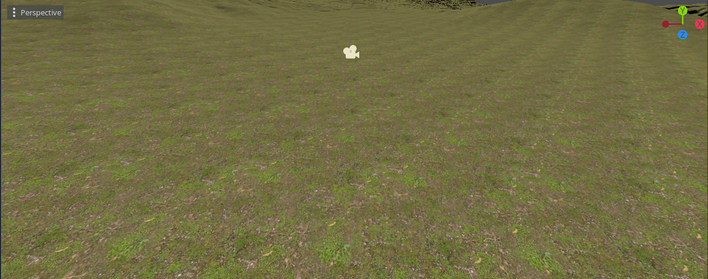

On shaders supporting it, the `tile_reduction` parameter allows to break the patterns a bit to attenuate the effect:

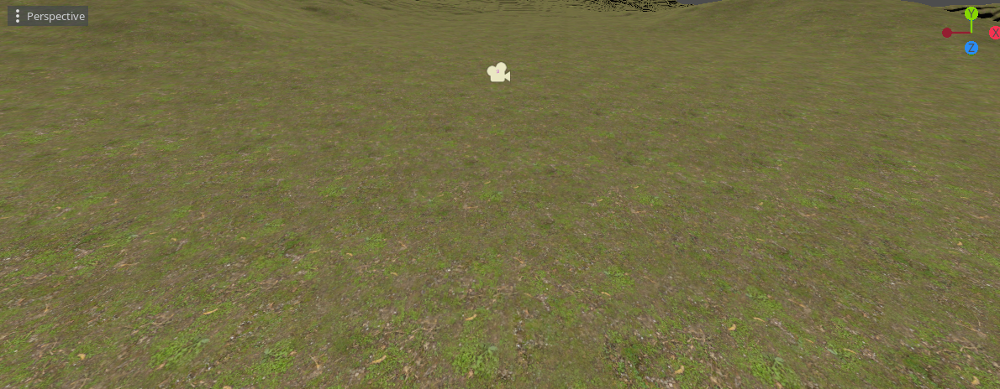

This option is present under the form of a `vec4`, where each component correspond to a texture, so you can enable it for some of them and not the others. Set a component to `1` to enable it, and `0` to disable it.

This algorithm makes the shader sample the texture a second time, at a different orientation and scale, at semi-random areas of the ground:

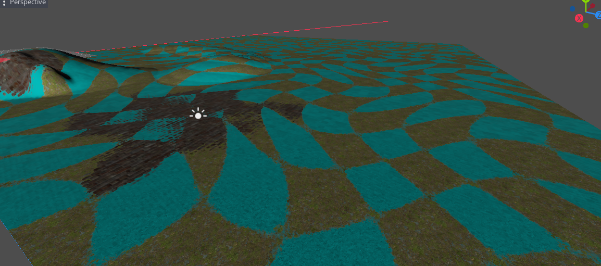

Here you can see where each of the two texture variants are being rendered. The pattern is a warped checker, which is simple enough to be procedural (avoiding the use of a noise texture), but organic enough so it shouldn't create artifacts itself. The result is made seamless by using depth blending (see [Depth blending](#depth-blending)).

Although it's still possible to notice repetition over larger distances, this can be better covered by using a fade to global map (see [Global map](#global-map)).
In addition, many games don't present a naked terrain to players: there are usually many props on top of it, such as grass, vegetation, trees, rocks, buildings, fog etc. so overall tiling textures should not really be a big deal.


### Painting only on slopes

The texture painting tool has a special option to limit the brush based on the slope of the terrain. This helps painting cliffs only or flat grounds only, without having to aim. It can even be used to paint a big area in one go, by increasing the brush size.

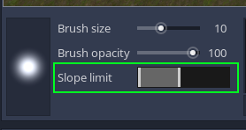

The control consists in a two-ways slider. You can drag two handles. The left handle controls minimum slope, the right handle controls maximum slope. The range between the two handles determines which slopes the brush will paint on.


### Color tint

You can color the terrain using the `Color` brush. This is pretty much modulating the albedo, which can help adding a touch of variety to the landscape. If you make custom shader tweaks, color can also be used for your own purpose if you need to.

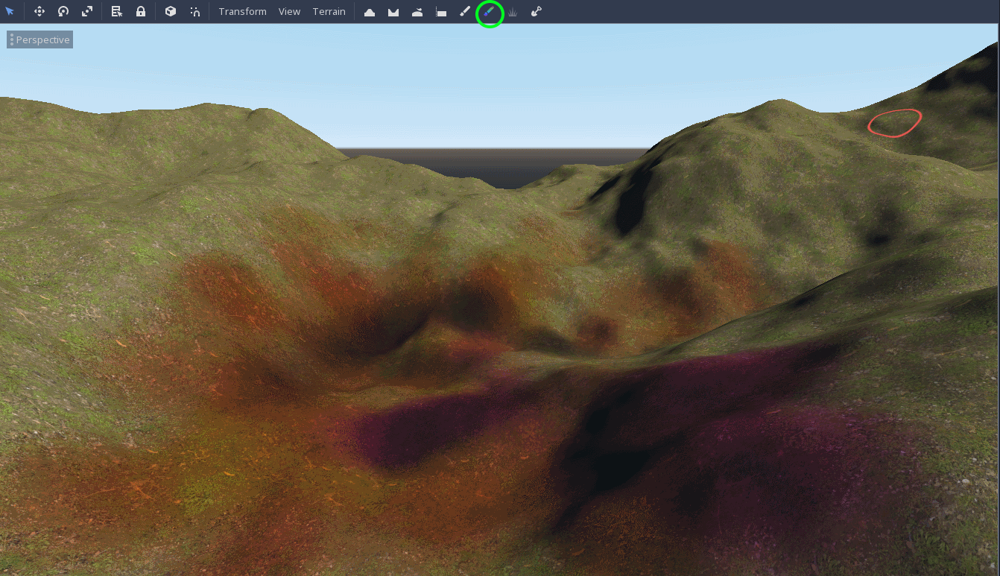

Depending on the shader, you may be able to choose which textures are affected by the colormap.


### Global map

For shading purposes, it can be useful to bake a global map of the terrain. A global map takes the average albedo of the ground all over the terrain, which allows other elements of the scene to use that without having to recompute the full blending process that the ground shader goes through. The current use cases for a global map is to tint grass, and use it as a distance fade in order to hide texture tiling in the very far distance. Together with the terrain's normal map it could also be used to make minimap previews.

To bake a global map, select the `HTerrain` node, go to the `Terrain` menu and click `Bake global map`. This will produce a texture in the terrain data directory which will be used by the default shaders automatically, depending on your settings.

If you use a custom shader, you can define a specific one to use for the global map, by assigning the `custom_globalmap_shader` property. This is usually a stripped-down version of the main ground shader, where only `ALBEDO` is important.

!!! note
    The globalmap is also used in the minimap to show the color of the terrain.


Terrain generator
-------------------

Basic sculpting tools can be useful to get started or tweaking, but it's cumbersome to make a whole terrain only using them. For larger scale terrain modeling, procedural techniques are often preferred, and then adjusted later on.

This plugin provides a simple procedural generator. To open it, click on the `HTerrain` node to see the `Terrain` menu, in which you select `generate...`. Note that you should have a properly setup terrain node before you can use it.

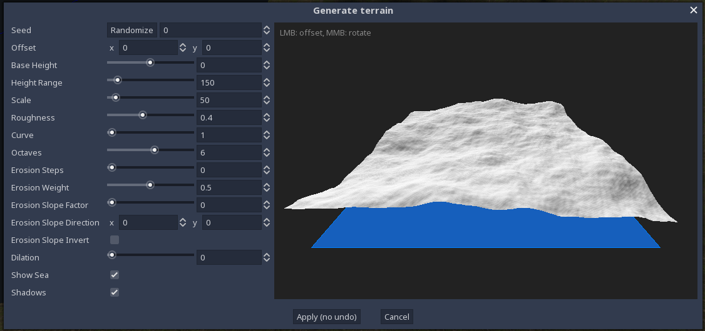

The generator is quite simple and combines a few common techniques to produce a heightmap. You can see a 3D preview which can be zoomed in with the mouse wheel and rotated by dragging holding middle click.

### Height range

`height range` and `base height` define which is the minimum and maximum heights of the terrain. The result might not be exactly reaching these boundaries, but it is useful to determine in which region the generator has to work in.

### Perlin noise

Perlin noise is very common in terrain generation, and this one is no exception. Multiple octaves (or layers) of noise are added together at varying strength, forming a good base that already looks like a good environment.

The usual parameters are available:

- `seed`: this chooses the random seed the perlin noise will be based on. Same number gives the same landscape.
- `offset`: this chooses where in the landscape the terrain will be cropped into. You can also change that setting by panning the preview with the right mouse button held.
- `scale`: expands or shrinks the length of the patterns. Higher scale gives lower-frequency relief.
- `octaves`: how many layers of noise to use. The more octaves, the more details there will be.
- `roughness`: this controls the strength of each octave relatively to the previous. The more you increase it, the more rough the terrain will be, as high-frequency octaves get a higher weight.

Try to tweak each of them to get an idea of how they affect the final shape.

### Erosion

The generator features morphological erosion. Behind this barbaric name hides a simple image processing algorithm, ).
In the context of terrains, what it does is to quickly fake real-life erosion, where rocks might slide along the slopes of the mountains over time, giving them a particular appearance. Perlin noise alone is nice, but with erosion it makes the result look much more realistic.


It's also possible to use dilation, which gives a mesa-like appearance.


There is also a slope direction parameter, this one is experimental but it has a tendency to simulate wind, kind of "pushing" the ground in the specified direction. It can be tricky to find a good value for this one but I left it because it can give interesting results, like sand-like ripples, which are an emergent behavior.

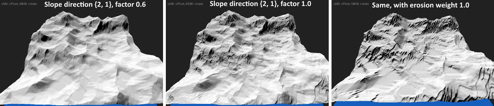

!!! note
    Contrary to previous options, erosion is calculated over a bunch of shader passes. In Godot 3, it is only possible to wait for one frame to be rendered every 16 milliseconds, so the more erosion steps you have, the slower the preview will be. In the future it would be nice if Godot allowed multiple frames to be rendered on demand so the full power of the GPU could be used.

### Applying

Once you are happy with the result, you can click "Apply", which will calculate the generated terrain at full scale on your scene. This operation currently can't be undone, so if you want to go back you should make a backup.


Import an existing terrain
-----------------------------

Besides using built-in tools to make your landscape, it can be convenient to import an existing one, which you might have made in specialized software such as WorldMachine, Scape or Lithosphere.

### Import dialog

To do this, select the `HTerrain` node, click on the `Terrain` menu and chose `Import`.
This window allows you to import several kinds of data, such as heightmap but also splatmap or color map.


There are a few things to check before you can successfully import a terrain though:

- The resolution should be power of two + 1, and square. If it isn't, the plugin will attempt to crop it, which might be OK or not if you can deal with map borders that this will produce.
- If you import a RAW heightmap, it has to be encoded using 16-bit unsigned integer format.
- If you import a PNG heightmap, Godot can only load it as 8-bit depth, so it is not recommended for high-range terrains because it doesn't have enough height precision.

This feature also can't be undone when executed, as all terrain data will be overwritten with the new one. If anything isn't correct, the tool will warn you before to prevent data loss.

It is possible that the height range you specify doesn't works out that well after you see the result, so for now it is possible to just re-open the importer window, change the height scale and apply again.


### 4-channel splatmaps caveat

Importing a 4-channel splatmap requires an RGBA image, where each channel will be used to represent the weight of a texture. However, if you are creating a splatmap by going through an image editor, *you must make sure the color data is preserved*.

Most image editors assume you create images to be seen. When you save a PNG, they assume fully-transparent areas don't need to store any color data, because they are invisible. The RGB channels are then compressed away, which can cause blocky artifacts when imported as a splatmap.

To deal with this, make sure your editor has an option to turn this off. In Gimp, for example, this option is here:


Detail layers
---------------

Once you have textured ground, you may want to add small detail objects to it, such as grass and small rocks.


### Painting details

Grass is supported throught `HTerrainDetailLayer` node. They can be created as children of the `HTerrain` node. Each layer represents one kind of detail, so you may have one layer for grass, and another for flowers, for example.

Detail layers come in two parts:

- A 8-bit density texture covering the whole terrain, also called a "detail map" at the moment. You can see how many maps the terrain has in the bottom panel after selecting the terrain.
- A `HTerrainDetailLayer` node, which uses one of the detail maps to render instanced models based on the density.

You can paint detail maps just like you paint anything else, using the same brush system. It uses opacity to either add more density, or act as an eraser with an opacity of zero.
`HTerrainDetailLayer` nodes will then update in realtime, rendering more or less instances in places you painted.

!!! note
    A detail map can be used by more than one node (by setting the same index in their `layer_index` property), so you can have one for grass, another for flowers, and paint on the shared map to see both nodes update at the same time.


### Shading options

At the moment, detail layers only come with a single shader type, which is made for grass. More may be added in the future.

You can choose which texture will be used, and it will be rendered using alpha-scissor. It is done that way because it allows drawing grass in the opaque render pass, which is cheaper than treating every single quad like a transparent object which would have to be depth-sorted to render properly. Alpha-to-coverage would look better, but isn't supported in Godot 3.

Like the ground, detail layers use a custom shader that takes advantage of the heightmap to displace each instanced object at a proper position. Also, hardware instancing is used under the hood to allow for a very high number of items with low cost. Multimeshes are generated in chunks, and then instances are hidden from the vertex shader depending on density. For grass, it also uses the normal of the ground so there is no need to provide it. There are also shader options to tint objects with the global map, which can help a lot making grass to blend better with the environment.

Finally, the shader fades in the distance by increasing the threshold of alpha scissor. This works better with a transparent texture. An alternative is to make it sink in the ground, but that's left to customization.

For writing custom shaders, see [Custom detail shaders](#grass-shaders).

### Meshes

By default, detail layers draw simple quads on top of the ground. But it is possible to choose another kind of geometry, by assigning the `instance_mesh` property.
Several meshes are bundled with the plugin, which you can find in `res://addons/zylann.hterrain/models/`.

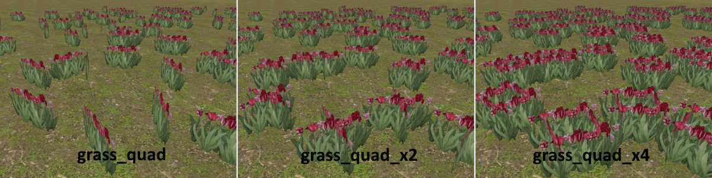

They are all thought for grass rendering. You can make your own for things that aren't grass, however there is no built-in shader for conventional objects at the moment (rocks, bits and bobs). So if you want normal shading you need to write a custom shader. That may be bundled too in the future.

!!! note
    Detail meshes must be `Mesh` resources, so the easiest way is to use the `OBJ` format. If you use `GLTF` or `FBX`, Godot will import it as a scene by default, so you may have to configure it to import as single mesh if possible.


Custom shaders
-----------------

This plugin comes with default shaders, but you are allowed to modify them and change things to match your needs. The plugin does not expose materials directly because it needs to set built-in parameters that are always necessary, and some of them cannot be properly saved as material properties, if at all. 

### Ground shaders

In order to write your own ground shader, select the `HTerrain` node, and change the shader type to `Custom`. Then, select the `custom shader` property and choose `New Shader`. This will create a new shader which is pre-filled with the same source code as the last built-in shader you had selected. Doing it this way can help seeing how every feature is done and find your own way into implementing customizations.

The plugin does not actually hardcode its features based on its built-in shaders. Instead, it looks at which `uniform` parameters your shader defines, and adapts in consequence.
A list of `uniform` parameters are recognized, some of which are required for heightmap rendering to work:

Parameter name                      | Type             | Format  | Description
------------------------------------|------------------|---------|--------------
`u_terrain_heightmap`               | `sampler2D`      | `RH`    | The heightmap, a half-precision float texture which can be sampled in the red channel. Like the other following maps, you have to access it using cell coordinates, which can be computed as seen in the built-in shader.
`u_terrain_normalmap`               | `sampler2D`      | `RGB8`  | The precalculated normalmap of the terrain, which you can use instead of computing it from the heightmap
`u_terrain_colormap`                | `sampler2D`      | `RGBA8` | The color map, which is the one modified by the color brush. The alpha channel is used for holes.
`u_terrain_splatmap`                | `sampler2D`      | `RGBA8` | The classic 4-component splatmap, where each channel determines the weight of a given texture. The sum of each channel across all splatmaps must be 1.0.
`u_terrain_splatmap_1`              | `sampler2D`      | `RGBA8` | Additional splatmap
`u_terrain_splatmap_2`              | `sampler2D`      | `RGBA8` | Additional splatmap
`u_terrain_splatmap_3`              | `sampler2D`      | `RGBA8` | Additional splatmap
`u_terrain_globalmap`               | `sampler2D`      | `RGB8`  | The global albedo map.
`u_terrain_splat_index_map`         | `sampler2D`      | `RGB8`  | An index map, used for texturing based on a `TextureArray`. the R, G and B components multiplied by 255.0 will provide the index of the texture.
`u_terrain_splat_weight_map`        | `sampler2D`      | `RG8`   | A 2-component weight map where a 3rd component can be obtained with `1.0 - r - g`, used for texturing based on a `TextureArray`. The sum of R and G must be 1.0.
`u_ground_albedo_bump_0`...`3`      | `sampler2D`      | `RGBA8` | These are up to 4 albedo textures for the ground, which you have to blend using the splatmap. Their alpha channel can contain bump.
`u_ground_normal_roughness_0`...`3` | `sampler2D`      | `RGBA8` | Similar to albedo, these are up to 4 normal textures to blend using the splatmap. Their alpha channel can contain roughness.
`u_ground_albedo_bump_array`        | `sampler2DArray` | `RGBA8` | Equivalent of the previous individual albedo textures, as an array. The plugin knows you use this texturing technique by checking the existence of this parameter.
`u_ground_normal_roughness_array`   | `sampler2DArray` | `RGBA8` | Equivalent of the previous individual normalmap textures, as an array.
`u_terrain_inverse_transform`       | `mat4x4`         |         | A 4x4 matrix containing the inverse transform of the terrain. This is useful if you need to calculate the position of the current vertex in world coordinates in the vertex shader, as seen in the builtin shader.
`u_terrain_normal_basis`            | `mat3x3`         |         | A 3x3 matrix containing the basis used for transforming normals. It is not always needed, but if you use `map scale` it is required to keep them correct.

You don't have to declare them all. It's fine if you omit some of them, which is good because it frees a slot in the limited amount of `uniforms`, especially for texture units.
Other parameters are not used by the plugin, and are shown procedurally under the `Shader params` section of the `HTerrain` node.


### Grass shaders

Detail layers follow the same design as ground shaders. In order to make your own, select the `custom shader` property and assign it a new empty shader. This will also fork the built-in shader, which at the moment is specialized into rendering grass quads.

They share the following parameters with ground shaders:

- `u_terrain_heightmap`
- `u_terrain_normalmap`
- `u_terrain_globalmap`
- `u_terrain_inverse_transform`

And there also have specific parameters which you can use:

Parameter name                      | Type             | Format  | Description
------------------------------------|------------------|---------|--------------
`u_terrain_detailmap`               | `sampler2D`      | `R8`    | This one contains the grass density, from 0 to 1. Depending on this, you may hide instances by outputting degenerate triangles, or let them pass through. The builtin shader contains an example.
`u_albedo_alpha`                    | `sampler2D`      | `RGBA8` | This is the texture applied to the whole model, typically transparent grass.
`u_view_distance`                   | `float`          |         | How far details are supposed to render. Beyond this range, the plugin will cull chunks away, so it is a good idea to use this in the shader to smoothly fade pixels in the distance to hide this process.
`u_ambient_wind`                    | `vec2`           |         | Combined `vec2` parameter for ambient wind. `x` is the amplitude, and `y` is a time value. It is better to use it instead of directly `TIME` because it allows to animate speed without causing stutters.


### Lookdev 

The plugin features an experimental debugging feature in the `Terrain` menu called "Lookdev". It temporarily replaces the ground shader with a simpler one which displays the raw value of a specific map. For example, you can see the actual values taken by a detail map by choosing one of them in the menu:

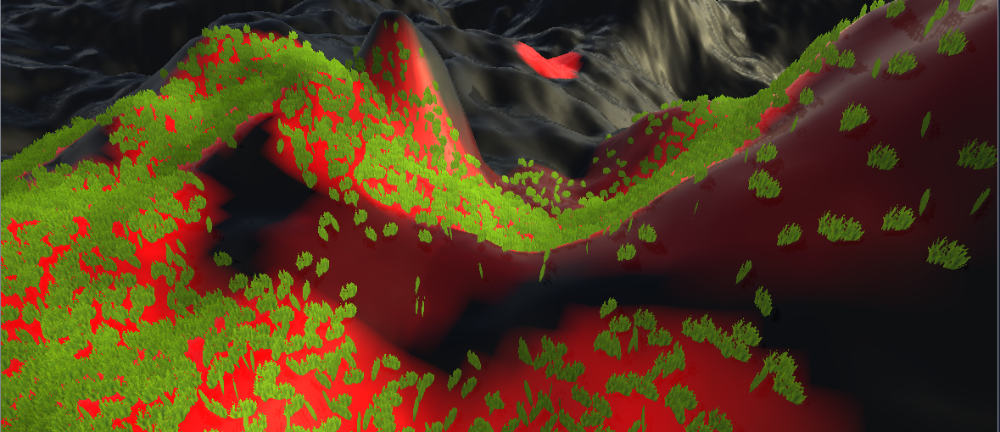

It is very simple at the moment but it can also be used to display data maps which are not necessarily used for rendering. So you could also use it to paint them, even if they don't translate into a visual element in the game.

To turn it off, select `Disabled` in the menu.


!!! note
    The heightmap cannot be seen with this feature because its values extend beyond usual color ranges.


Scripting
--------------

### Overview

Scripts relevant to in-game functionality are located under the plugin's root folder, `res://addons/zylann.hterrain/`.

```
res://
- addons/
    - zylann.hterrain/
        - doc/
        - models/                    <-- Models used for grass
        - native/                    <-- GDNative library
        - shaders/                   
        - tools/                     <-- Editor-specific stuff, don't use in game
        - util/                      <-- Various helper scripts

        - hterrain.gd                <-- The HTerrain node
        - hterrain_data.gd           <-- The HTerrainData resource
        - hterrain_detail_layer.gd   <-- The HTerrainDetailLayer node

        - (other stuff used internally)
```

This plugin does not use global class names, so to use or hint one of these types, you may want to "const-import" them on top of your script, like so:

```gdscript
const HTerrain = preload("res://addons/zylann.hterrain/hterrain.gd")
```

There is no API documentation yet, so if you want to see which functions and properties are available, take a look at the source code in the editor.
Functions and properties beginning with a `_` are private and should not be used directly.


### Creating the terrain from script

You can decide to create the terrain from a script. Here is an example:

```gdscript
extends Node

const HTerrain = preload("res://addons/zylann.hterrain/hterrain.gd")
const HTerrainData = preload("res://addons/zylann.hterrain/hterrain_data.gd")

func _ready():
    var data = HTerrainData.new()
    data.resize(513)
    
    var terrain = HTerrain.new()
    terrain.set_data(data)
    add_child(terrain)
```

### Modifying terrain from script

The terrain is described by several types of large textures, such as heightmap, normal map, grass maps, color map and so on. Modifying the terrain boils down to modifying them using the `Image` API.

For example, this code will tint the ground red at a specific position (in pixels, not world space):

```gdscript
const HTerrainData = preload("res://addons/zylann.hterrain/hterrain_data.gd")

onready var _terrain = $Path/To/Terrain

func test():
    # Get the image
    var data : HTerrainData = _terrain.get_data()
    var colormap : Image = data.get_image(HTerrainData.CHANNEL_COLOR)

    # Modify the image
    var position = Vector2(42, 36)
    colormap.lock()
    colormap.set_pixel(position, Color(1, 0, 0))
    colormap.unlock()

    # Notify the terrain of our change
    data.notify_region_changed(Rect2(position.x, position.y, 1, 1), HTerrainData.CHANNEL_COLOR)
```

The same goes for the heightmap and grass maps, however at time of writing, there are several issues with editing it in game:

- Normals of the terrain don't automatically update, you have to calculate them yourself by also modifying the normalmap. This is a bit tedious and expensive, however it may be improved in the future. Alternatively you could compute them in shader, but it makes rendering a bit more expensive.
- The collider won't update either, for the same reason mentionned in the [section about collisions in the editor](#Collisions). You can force it to update by calling `update_collider()` but it can cause a hiccup.


### Procedural generation

It is possible to generate the terrain data entirely from script. It may be quite slow if you don't take advantage of GPU techniques (such as using a compute viewport), but it's still useful to copy results to the terrain or editing it like the plugin does in the editor.

Again, we can use the `Image` resource to modify pixels.
Here is a full GDScript example generating a terrain from noise and 3 textures:

```gdscript
extends Node

# Import classes
const HTerrain = preload("res://addons/zylann.hterrain/hterrain.gd")
const HTerrainData = preload("res://addons/zylann.hterrain/hterrain_data.gd")
const HTerrainTextureSet = preload("res://addons/zylann.hterrain/hterrain_texture_set.gd")

# You may want to change paths to your own textures
var grass_texture = load("res://addons/zylann.hterrain_demo/textures/ground/grass_albedo_bump.png")
var sand_texture = load("res://addons/zylann.hterrain_demo/textures/ground/sand_albedo_bump.png")
var leaves_texture = load("res://addons/zylann.hterrain_demo/textures/ground/leaves_albedo_bump.png")


func _ready():
    # Create terrain resource and give it a size.
    # It must be either 513, 1025, 2049 or 4097.
    var terrain_data = HTerrainData.new()
    terrain_data.resize(513)
    
    var noise = OpenSimplexNoise.new()
    var noise_multiplier = 50.0

    # Get access to terrain maps
    var heightmap: Image = terrain_data.get_image(HTerrainData.CHANNEL_HEIGHT)
    var normalmap: Image = terrain_data.get_image(HTerrainData.CHANNEL_NORMAL)
    var splatmap: Image = terrain_data.get_image(HTerrainData.CHANNEL_SPLAT)
    
    heightmap.lock()
    normalmap.lock()
    splatmap.lock()
    
    # Generate terrain maps
    # Note: this is an example with some arbitrary formulas,
    # you may want to come up with your owns
    for z in heightmap.get_height():
        for x in heightmap.get_width():
            # Generate height
            var h = noise_multiplier * noise.get_noise_2d(x, z)
            
            # Getting normal by generating extra heights directly from noise,
            # so map borders won't have seams in case you stitch them
            var h_right = noise_multiplier * noise.get_noise_2d(x + 0.1, z)
            var h_forward = noise_multiplier * noise.get_noise_2d(x, z + 0.1)
            var normal = Vector3(h - h_right, 0.1, h_forward - h).normalized()
            
            # Generate texture amounts
            var splat = splatmap.get_pixel(x, z)
            var slope = 4.0 * normal.dot(Vector3.UP) - 2.0
            # Sand on the slopes
            var sand_amount = clamp(1.0 - slope, 0.0, 1.0)
            # Leaves below sea level
            var leaves_amount = clamp(0.0 - h, 0.0, 1.0)
            splat = splat.linear_interpolate(Color(0,1,0,0), sand_amount)
            splat = splat.linear_interpolate(Color(0,0,1,0), leaves_amount)
            
            heightmap.set_pixel(x, z, Color(h, 0, 0))
            normalmap.set_pixel(x, z, HTerrainData.encode_normal(normal))
            splatmap.set_pixel(x, z, splat)
    
    heightmap.unlock()
    normalmap.unlock()
    splatmap.unlock()
    
    # Commit modifications so they get uploaded to the graphics card
    var modified_region = Rect2(Vector2(), heightmap.get_size())
    terrain_data.notify_region_change(modified_region, HTerrainData.CHANNEL_HEIGHT)
    terrain_data.notify_region_change(modified_region, HTerrainData.CHANNEL_NORMAL)
    terrain_data.notify_region_change(modified_region, HTerrainData.CHANNEL_SPLAT)

    # Create texture set
    # NOTE: usually this is not made from script, it can be built with editor tools
    var texture_set = HTerrainTextureSet.new()
    texture_set.set_mode(HTerrainTextureSet.MODE_TEXTURES)
    texture_set.insert_slot(-1)
    texture_set.set_texture(0, HTerrainTextureSet.TYPE_ALBEDO_BUMP, grass_texture)
    texture_set.insert_slot(-1)
    texture_set.set_texture(1, HTerrainTextureSet.TYPE_ALBEDO_BUMP, sand_texture)
    texture_set.insert_slot(-1)
    texture_set.set_texture(2, HTerrainTextureSet.TYPE_ALBEDO_BUMP, leaves_texture)

    # Create terrain node
    var terrain = HTerrain.new()
    terrain.set_shader_type(HTerrain.SHADER_CLASSIC4_LITE)
    terrain.set_data(terrain_data)
    terrain.set_texture_set(texture_set)
    add_child(terrain)
    
    # No need to call this, but you may need to if you edit the terrain later on
    #terrain.update_collider()
```


Export
----------

The plugin should work normally in exported games, but there are some files you should be able to remove because they are editor-specific. This allows to reduce the size from the executable a little.

Everything under `res://addons/zylann.hterrain/tools/` folder is required for the plugin to work in the editor, but it can be removed in exported games. You can specify this folder in your export presets:

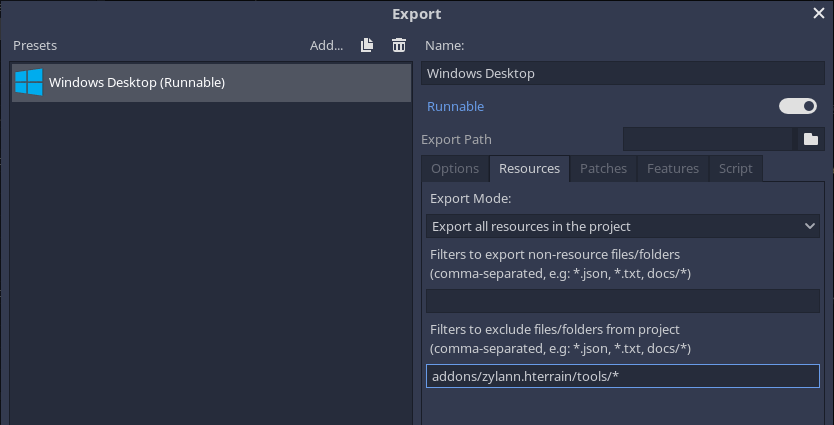

The documentation in `res://addons/zylann.hterrain/doc/` can also be removed, but this one contains a `.gdignore` file so hopefully Godot will automatically ignore it even in the editor.


GDNative
-----------

This plugin contains an optional native component, which speeds up some operations such as sculpting the terrain. However, at time of writing, a prebuilt binary is built-in only on `Windows` and `Linux`, I'm not yet able to build for other platforms so you may need to do it yourself, until I can provide an official one.

Before doing this, it's preferable to close the Godot editor so it won't lock the library files.
Note that these steps are very similar to GDNative C++ development, which repeats parts of [Godot's documentation](https://docs.godotengine.org/en/3.2/tutorials/plugins/gdnative/gdnative-cpp-example.html).

### Building instructions

To build the library, you will need to install the following:

- Python 3.6 or later
- The SCons build system
- A C++ compiler
- The Git version control system

#### If you got the plugin from the asset library

You will need to download C++ bindings for Godot. Go to `res://addons/zylann.hterrain/native`, open a command prompt, and run the following commands:

```
git clone https://github.com/GodotNativeTools/godot-cpp
cd godot-cpp
git submodule update --init --recursive
```

#### If you cloned the plugin using Git

In this case the C++ bindings submodule will already be there, and will need to be updated. Go to `res://addons/zylann.hterrain/native`, open a command prompt, and run the following commands:

```
git submodule update --init --recursive target=release
``` 

#### Build C++ bindings

Now go to `res://addons/zylann.hterrain/native/cpp-bindings`, open a command prompt (or re-use the one you have already), and run this command:

```
scons platform=<yourplatform> generate_bindings=yes target=release
```

`yourplatform` must match the platform you want to build for. It should be one of the following:

- `windows`
- `linux`
- `osx`

#### Build the HTerrain library

Go back to `res://addons/zylann.hterrain/native`, and run this command, which has similar options as the one we saw before:

```
scons platform=<yourplatform> target=release
```

This will produce a library file under the `bin/` folder.

### Register the library

Now the last step is to tell the plugin the library is available. In the `native/` folder, open the `hterrain.gdnlib` resource in a text editor, and add the path to the library under the `[entry]` category. Here is an example of how it should look like for several platforms:

```
[general]

singleton=false
load_once=true
symbol_prefix="godot_"
reloadable=false

[entry]

OSX.64 = "res://addons/zylann.hterrain/native/bin/osx64/libhterrain_native.dylib"
OSX.32 = "res://addons/zylann.hterrain/native/bin/osx32/libhterrain_native.dylib"
Windows.64 = "res://addons/zylann.hterrain/native/bin/win64/libhterrain_native.dll"
X11.64 = "res://addons/zylann.hterrain/native/bin/linux/libhterrain_native.so"

[dependencies]

Windows.64=[  ]
X11.64=[  ]
```

Finally, open the `factory.gd` script, and add an OS entry for your platform. The plugin should now be ready to use the native library.

### Debugging

If you get a crash or misbehavior, check logs first to make sure Godot was able to load the library. If you want to use a C++ debugger, you can repeat this setup, only  replacing `release` with `debug` when running SCons. This will then allow you to attach to Godot and place breakpoints (which works best if you also use a debug Godot version).


Troubleshooting
-----------------

We do the best we can on our free time to make this plugin usable, but it's possible bugs appear. Some of them are known issues. If you have a problem, please refer to the [issue tracker](https://github.com/Zylann/godot_heightmap_plugin/issues).


### Before reporting any bug

- Make sure you have the latest version of the plugin
- Make sure it hasn't been reported already (including closed issues)
- Check your Godot version. This plugin only works starting from Godot 3.1, and does not support 4.x yet. It is also possible that some issues exist in Godot 3.1 but could only be fixed in later versions.
- Make sure you are using the GLES3 renderer. GLES2 is not supported.
- Make sure your addons folder is located at `res://addons`, and does not contain uppercase letters. This might work on Windows but it will break after export.


### If you report a new bug

If none of the initial checks help and you want to post a new issue, do the following:

- Check the console for messages, warnings and errors. These are helpful to diagnose the issue.
- Try to reproduce the bug with precise reproduction steps, and indicate them
- Provide a test project with those steps (unless it's reproducible from an empty project), so that we can reproduce the bug and fix it more easily. Github allows you to drag-and-drop zip files.
- Indicate your OS, Godot version and graphics card model. Those are present in logs as well.


### Terrain not saving / not up to date / not showing

This issue happened a few times and had various causes so if the checks mentionned before don't help:

- Check the contents of your terrain's data folder. It must contain a `.hterrain` file and a few textures.
- If they are present, make sure Godot has imported those textures. If it didn't, unfocus the editor, and focus it back (you should see a short progress bar as it does it)
- Check if you used Ctrl+Z (undo) after a non-undoable action, like described in [issue #101](https://github.com/Zylann/godot_heightmap_plugin/issues/101)
- Make sure your `res://addons` folder is named `addons` *exactly lowercase*. It should not be named `Addons`. Plugins can fail if this convention is not respected.
- If your problem relates to collisions in editor, update the collider using `Terrain -> Update Editor Collider`, because this one does not update automatically yet
- Godot seems to randomly forget where the terrain saver is, but I need help to find out why because I could never reproduce it. See [issue #120](https://github.com/Zylann/godot_heightmap_plugin/issues/120)


### Temporary files

The plugin creates temporary files to avoid cluttering memory. They are necessary for some functionalities to work. Those files should be cleaned up automatically when you close the editor or if you turn off the plugin. However, if a crash occurs or something else goes wrong, they might not get removed. If you want to check them out, they are located in `user://hterrain_image_cache`.

On Windows, that directory corresponds to `C:\Users\Username\AppData\Roaming\Godot\app_userdata\ProjectName\hterrain_image_cache`.

See [Godot's documentation](https://docs.godotengine.org/en/stable/tutorials/io/data_paths.html#editor-data-paths) for other platforms.
